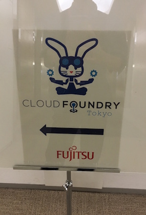

### Cloud Foundry Tokyo Meetup #2

http://www.meetup.com/Cloud-Foundry-Tokyo-Meetup/events/230285366/

## Talk
Cloud Foundry Foundation introduction (Michael Pinette, CFF)
 * No slide, just quick introduction

Cloud Foundry CLI PM in Tokyo (Dies Koper, Fujitsu Australia)   
 * Slideshare   TBD

Introduction to Bosh 2.0 (Gwenn Etourneau, Pivotal) 
 * Slideshare http://www.slideshare.net/gwennetourneau/bosh-20reloaded
  
Implement Service broker with Spring Boot (Toshiaki Maki, Pivotal) 
 * Slideshare http://www.slideshare.net/makingx/implement-service-broker-with-spring-boot-cftokyo
 * Demo & Code https://github.com/making/fake-service-broker

Cloud Foundry and Japanese-style System Integration (Isoo Ueno, NTT) 
 * Slide TDB

Challenge for Glassfish Buildpack (Kenji Kazumura, Fujitsu Limited)  
 * Slide TDB

#Picture
 You can find all picture there
https://drive.google.com/drive/u/0/folders/0B6-cY13f0pq6SFR5YUhfUklLRWc

